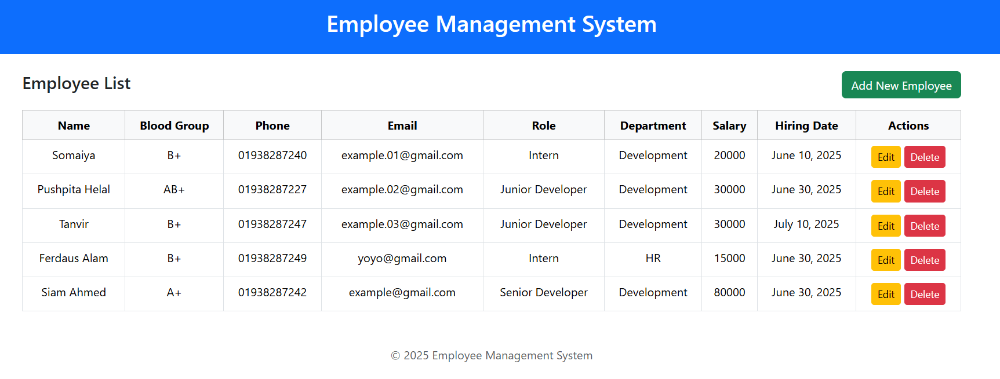

# Employee Management System

A Django-based web application designed to manage employee records efficiently. This system allows administrators to perform CRUD (Create, Read, Update, Delete) operations on employee data, including personal details, department assignments, roles, and more.

##  Features

- **CRUD Operations**: Add, view, edit, and delete employee records.
- **Department & Role Management**: Assign employees to departments and roles.
- **Blood Group Selection**: Choose from predefined blood groups using a dropdown.
- **Responsive UI**: Built with Bootstrap for a clean and responsive design.
-  **MySQL Database**: Uses MySQL for robust and scalable data storage. 


##  Project View


## How to Run

1. **Clone the Repository**

   ```bash
   git clone https://github.com/Somaiya-0/employee_management_django.git

   cd employee_management_django

2. Create and Activate Virtual Environment
    ```bash
    python -m venv venv
    source venv/bin/activate  
    # On Windows use `venv\Scripts\activate`
3. Install Dependencies
    ```bash
    pip install django
    pip install mysqlclient
4. Configure MySQL Database in settings.py
    ```bash
        DATABASES = {
        'default': {
            'ENGINE': 'django.db.backends.mysql',
            'NAME': 'your_db_name',
            'USER': 'your_mysql_user',
            'PASSWORD': 'your_password',
            'HOST': 'localhost',
            'PORT': '3306',
        }
    }

5. Run migrations:  

   ```bash
   python manage.py makemigrations employee_app
   python manage.py migrate
6. Run server:
    ```bash
    python manage.py runserver
Access the application at http://127.0.0.1:8000/.

## Usage

- The **Home page** lists all employees in a table.
- Use the **Add New Employee** button to add employees.
- Each employee row has **Edit** and **Delete** buttons for updating or removing employees.
- Forms use dropdowns for departments, roles, and blood groups.

##  Templates Overview

- **base.html**: Main layout template using Bootstrap, includes header, footer, and content block.
- **index.html**: Extends `base.html`, shows employee list with Add/Edit/Delete buttons.
- **add_employee.html**: Extends `base.html`, form to add a new employee with dropdowns.
- **update_employee.html**: Extends `base.html`, form to update existing employee details.

## Notes

- Once an employee is deleted, it cannot be restored.
- All forms have CSRF protection enabled.
- Hiring date must be entered or pre-filled correctly when adding or updating employees.
- Blood group is stored as a coded value but displayed as a label.


## Author

[Somaiya-0](https://github.com/Somaiya-0)


##  License

This project is open-source and free to use.
